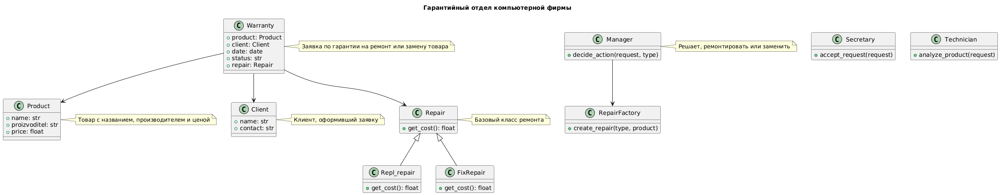

## 📘 Описание
Данный проект реализует простую **систему учёта гарантийных заявок** на товары без использования базы данных  
Он моделирует процесс обработки заявок через классы: от приёма товара до решения менеджера (ремонт или замена)  
Результаты работы автоматически сохраняются в **Excel-файл** с помощью `pandas` и `openpyxl`

## 🧠 Цель проекта
Показать применение **объектно-ориентированного программирования (ООП)**, паттернов проектирования и генерации отчётов на Python

---

## ⚙️ Используемый стек технологий

| Компонент | Назначение |
|------------|-------------|
| **Python 3.13.7** | Язык реализации |
| **pandas** | Формирование таблиц и группировка данных (нужно для генерации файла excel) |
| **openpyxl** | Работа с Excel-файлами |
| **datetime** | Используется для указания даты заявок |

---

## 🏗️ Архитектура и логика работы

### 1. Классы предметной области

#### `Product`
Хранит данные о товаре:
- `name` — название товара  
- `proizvoditel` — производитель  
- `price` — цена  

#### `Client`
Содержит информацию о клиенте:
- `name` — имя  
- `contact` — контакт (например, email)

#### `Warranty`
Представляет гарантийную заявку:
- `product` — товар  
- `client` — клиент  
- `date` — дата обращения  
- `status` — статус заявки  
- `repair` — объект ремонта (ремонт или замена)

---

### 2. Классы, отвечающие за обработку заявок

#### `Secretary`
Принимает заявку и меняет статус на `"Принята"`

#### `Technician`
Проверяет товар, меняет статус на `"Проверена"`

#### `Manager`
Принимает решение о типе ремонта (ремонт или замена)  
Использует **фабрику ремонтов** `RepairFactory`, чтобы создать соответствующий объект

---

### 3. Иерархия классов ремонта

#### Базовый класс `Repair`
- Принимает объект товара
- Метод `get_cost()` возвращает 0 по умолчанию

#### Подклассы:
- **`Repl_repair`** — замена товара (стоимость = цена товара)
- **`FixRepair`** — ремонт товара (фиксированная стоимость = 50)

#### `RepairFactory`
Реализует **паттерн проектирования “Фабричный метод”**, создавая нужный тип ремонта в зависимости от переданного аргумента (`"ремонт"` или `"замена"`)

---

### 4. Основной сценарий работы

1. Создаются товары и клиент  
2. Создаются заявки (`Warranty`) на каждый товар  
3. Секретарь принимает заявку  
4. Техник проверяет товар  
5. Менеджер принимает решение о действии (ремонт или замена)  
6. После обработки заявки формируется отчёт в виде таблицы

---

## 📊 Формирование отчёта

1. Собираются данные о каждой заявке:
   - Товар  
   - Производитель  
   - Тип ремонта  
   - Стоимость  
   - Клиент  
   - Дата

2. С помощью `pandas.DataFrame` создаётся таблица

3. Итоговая сумма расходов по типам ремонта считается через группировку:
   ```python
   df_sum = df.groupby("Тип ремонта")["Стоимость"].sum().reset_index()
